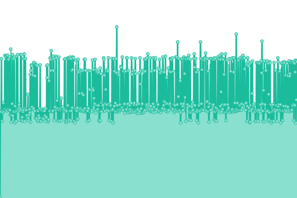
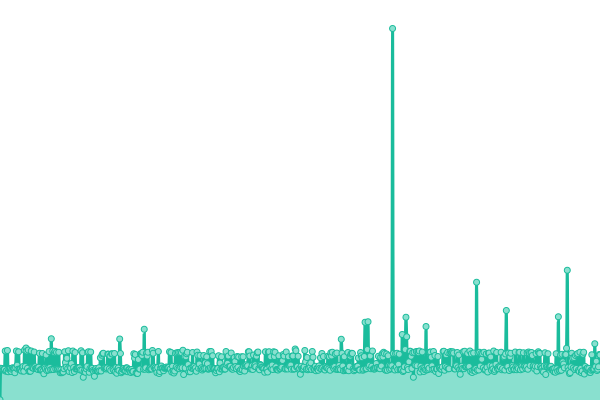
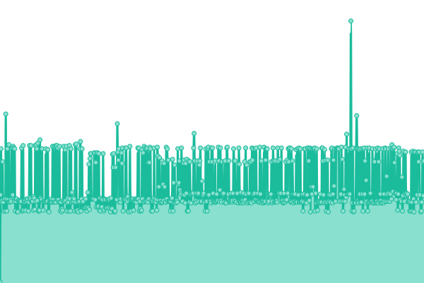
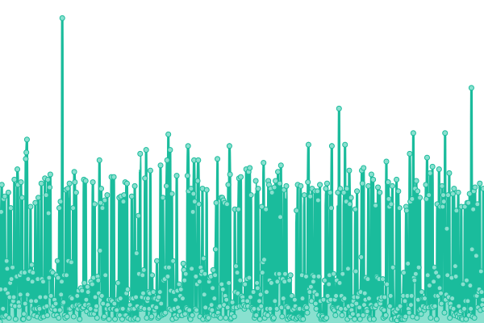
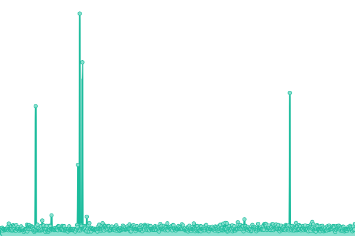
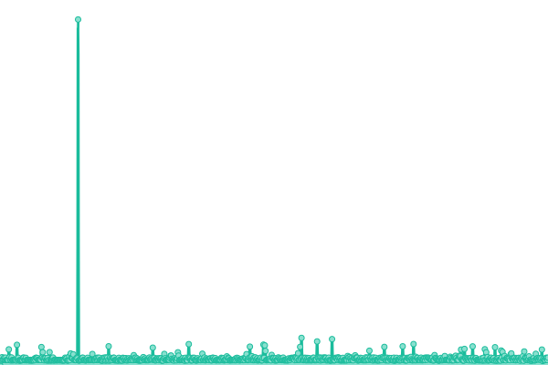
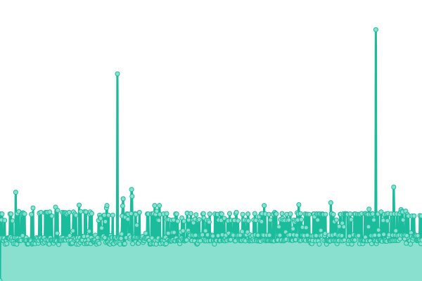
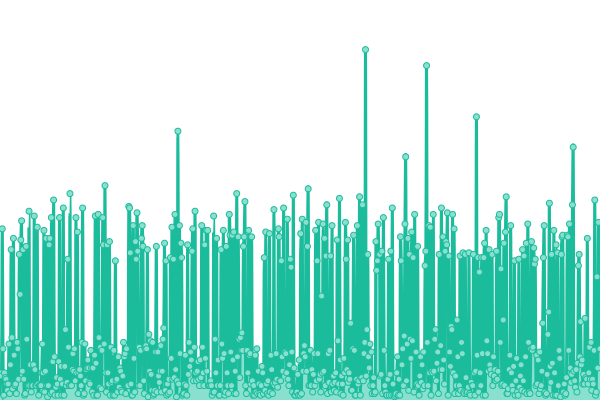

# [📈 Live Status](https://rocket-meals.github.io/rocket-meals-uptime): <!--live status--> **🟩 All systems operational**

This repository contains the open-source uptime monitor and status page for [Rocket Meals](https://rocket-meals.de), powered by [Upptime](https://github.com/upptime/upptime).

<!--start: status pages-->
<!-- This summary is generated by Upptime (https://github.com/upptime/upptime) -->
<!-- Do not edit this manually, your changes will be overwritten -->
<!-- prettier-ignore -->
| URL | Status | History | Response Time | Uptime |
| --- | ------ | ------- | ------------- | ------ |
|  [Test Rocket Meals - API Settings](https://test.rocket-meals.de/rocket-meals/api/items/app_settings) | 🟩 Up | [test-rocket-meals-api-settings.yml](https://github.com/rocket-meals/rocket-meals-uptime/commits/HEAD/history/test-rocket-meals-api-settings.yml) | 

 688ms
     
 | 

<a href="https://rocket-meals.github.io/rocket-meals-uptime/history/test-rocket-meals-api-settings">100.00%</a>
    

|  [Test Rocket Meals - API Canteens](https://test.rocket-meals.de/rocket-meals/api/items/canteens) | 🟩 Up | [test-rocket-meals-api-canteens.yml](https://github.com/rocket-meals/rocket-meals-uptime/commits/HEAD/history/test-rocket-meals-api-canteens.yml) | 

 171ms
     
 | 

<a href="https://rocket-meals.github.io/rocket-meals-uptime/history/test-rocket-meals-api-canteens">100.00%</a>
    

|  [Test Rocket Meals - API Ping](https://test.rocket-meals.de/rocket-meals/api/server/ping) | 🟩 Up | [test-rocket-meals-api-ping.yml](https://github.com/rocket-meals/rocket-meals-uptime/commits/HEAD/history/test-rocket-meals-api-ping.yml) | 

 131ms
     
 | 

<a href="https://rocket-meals.github.io/rocket-meals-uptime/history/test-rocket-meals-api-ping">100.00%</a>
    

|  [Test Rocket Meals - Web](https://rocket-meals.github.io/rocket-meals/) | 🟩 Up | [test-rocket-meals-web.yml](https://github.com/rocket-meals/rocket-meals-uptime/commits/HEAD/history/test-rocket-meals-web.yml) | 

 92ms
     
 | 

<a href="https://rocket-meals.github.io/rocket-meals-uptime/history/test-rocket-meals-web">100.00%</a>
    

|  [SWOSY - API Settings](https://swosy.rocket-meals.de/rocket-meals/api/items/app_settings) | 🟩 Up | [swosy-api-settings.yml](https://github.com/rocket-meals/rocket-meals-uptime/commits/HEAD/history/swosy-api-settings.yml) | 

 659ms
     
 | 

<a href="https://rocket-meals.github.io/rocket-meals-uptime/history/swosy-api-settings">100.00%</a>
    

|  [SWOSY - API Canteens](https://swosy.rocket-meals.de/rocket-meals/api/items/canteens) | 🟩 Up | [swosy-api-canteens.yml](https://github.com/rocket-meals/rocket-meals-uptime/commits/HEAD/history/swosy-api-canteens.yml) | 

 151ms
     
 | 

<a href="https://rocket-meals.github.io/rocket-meals-uptime/history/swosy-api-canteens">100.00%</a>
    

|  [SWOSY - API Ping](https://swosy.rocket-meals.de/rocket-meals/api/server/ping) | 🟩 Up | [swosy-api-ping.yml](https://github.com/rocket-meals/rocket-meals-uptime/commits/HEAD/history/swosy-api-ping.yml) | 

 122ms
     
 | 

<a href="https://rocket-meals.github.io/rocket-meals-uptime/history/swosy-api-ping">100.00%</a>
    

|  [SWOSY - Web](https://rocket-meals.github.io/swosy/) | 🟩 Up | [swosy-web.yml](https://github.com/rocket-meals/rocket-meals-uptime/commits/HEAD/history/swosy-web.yml) | 

 42ms
     
 | 

<a href="https://rocket-meals.github.io/rocket-meals-uptime/history/swosy-web">100.00%</a>
    

|  [Studi-Futter - API Appsettings](https://studi-futter.rocket-meals.de/rocket-meals/api/items/app_settings) | 🟩 Up | [studi-futter-api-appsettings.yml](https://github.com/rocket-meals/rocket-meals-uptime/commits/HEAD/history/studi-futter-api-appsettings.yml) | 

 690ms
     
 | 

<a href="https://rocket-meals.github.io/rocket-meals-uptime/history/studi-futter-api-appsettings">100.00%</a>
    

|  [Studi-Futter - API Canteens](https://studi-futter.rocket-meals.de/rocket-meals/api/items/canteens) | 🟩 Up | [studi-futter-api-canteens.yml](https://github.com/rocket-meals/rocket-meals-uptime/commits/HEAD/history/studi-futter-api-canteens.yml) | 

 173ms
     
 | 

<a href="https://rocket-meals.github.io/rocket-meals-uptime/history/studi-futter-api-canteens">100.00%</a>
    

|  [Studi-Futter - API Ping](https://studi-futter.rocket-meals.de/rocket-meals/api/server/ping) | 🟩 Up | [studi-futter-api-ping.yml](https://github.com/rocket-meals/rocket-meals-uptime/commits/HEAD/history/studi-futter-api-ping.yml) | 

 126ms
     
 | 

<a href="https://rocket-meals.github.io/rocket-meals-uptime/history/studi-futter-api-ping">100.00%</a>
    

|  [Studi-Futter - Web](https://rocket-meals.github.io/studi-futter/) | 🟩 Up | [studi-futter-web.yml](https://github.com/rocket-meals/rocket-meals-uptime/commits/HEAD/history/studi-futter-web.yml) | 

 41ms
     
 | 

<a href="https://rocket-meals.github.io/rocket-meals-uptime/history/studi-futter-web">100.00%</a>
    

<!--end: status pages-->

[**Visit our status website →**](https://rocket-meals.github.io/rocket-meals-uptime)

## 📄 License

- Powered by: [Upptime](https://github.com/upptime/upptime)
- Code: [MIT](./LICENSE) © [Anand Chowdhary](https://anandchowdhary.com), supported by [Pabio](https://pabio.com)
- Data in the `./history` directory: [Open Database License](https://opendatacommons.org/licenses/odbl/1-0/)
