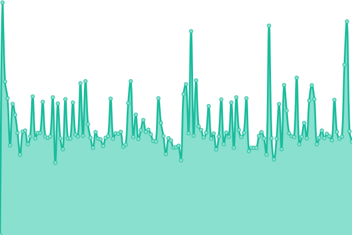
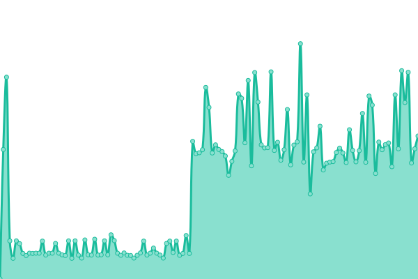
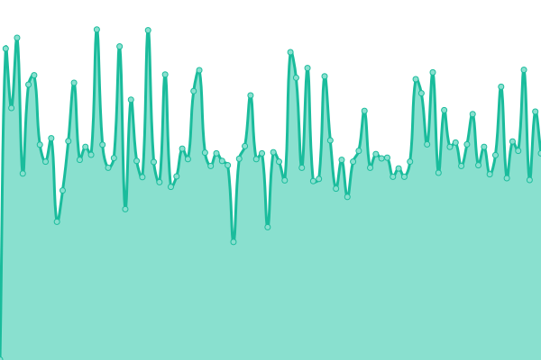

# [📈 Live Status](https://rocket-meals.github.io/rocket-meals-uptime): <!--live status--> **🟩 All systems operational**

This repository contains the open-source uptime monitor and status page for [Rocket Meals](https://rocket-meals.de), powered by [Upptime](https://github.com/upptime/upptime).

With [Upptime](https://upptime.js.org), you can get your own unlimited and free uptime monitor and status page, powered entirely by a GitHub repository. We use [Issues](https://github.com/rocket-meals/rocket-meals-uptime/issues) as incident reports, [Actions](https://github.com/rocket-meals/rocket-meals-uptime/actions) as uptime monitors, and [Pages](https://rocket-meals.github.io/rocket-meals-uptime) for the status page.

<!--start: status pages-->
<!-- This summary is generated by Upptime (https://github.com/upptime/upptime) -->
<!-- Do not edit this manually, your changes will be overwritten -->
<!-- prettier-ignore -->
| URL | Status | History | Response Time | Uptime |
| --- | ------ | ------- | ------------- | ------ |
|  [Test Rocket Meals](https://test.rocket-meals.de/rocket-meals/api/server/ping) | 🟩 Up | [test-rocket-meals.yml](https://github.com/rocket-meals/rocket-meals-uptime/commits/HEAD/history/test-rocket-meals.yml) | 

 663ms
     
 | 

<a href="https://rocket-meals.github.io/rocket-meals-uptime/history/test-rocket-meals">100.00%</a>
    

|  [Test Rocket Meals News](https://swosy.rocket-meals.de/rocket-meals/api/items/news?limit=10) | 🟩 Up | [test-rocket-meals-news.yml](https://github.com/rocket-meals/rocket-meals-uptime/commits/HEAD/history/test-rocket-meals-news.yml) | 

 641ms
     
 | 

<a href="https://rocket-meals.github.io/rocket-meals-uptime/history/test-rocket-meals-news">100.00%</a>
    

|  [SWOSY](https://swosy.rocket-meals.de/rocket-meals/api/server/ping) | 🟩 Up | [swosy.yml](https://github.com/rocket-meals/rocket-meals-uptime/commits/HEAD/history/swosy.yml) | 

 149ms
     
 | 

<a href="https://rocket-meals.github.io/rocket-meals-uptime/history/swosy">100.00%</a>
    

|  [Studi-Futter](https://studi-futter.rocket-meals.de/rocket-meals/api/server/ping) | 🟩 Up | [studi-futter.yml](https://github.com/rocket-meals/rocket-meals-uptime/commits/HEAD/history/studi-futter.yml) | 

 621ms
     
 | 

<a href="https://rocket-meals.github.io/rocket-meals-uptime/history/studi-futter">100.00%</a>
    

<!--end: status pages-->

[**Visit our status website →**](https://rocket-meals.github.io/rocket-meals-uptime)

## 📄 License

- Powered by: [Upptime](https://github.com/upptime/upptime)
- Code: [MIT](./LICENSE) © [Anand Chowdhary](https://anandchowdhary.com), supported by [Pabio](https://pabio.com)
- Data in the `./history` directory: [Open Database License](https://opendatacommons.org/licenses/odbl/1-0/)
